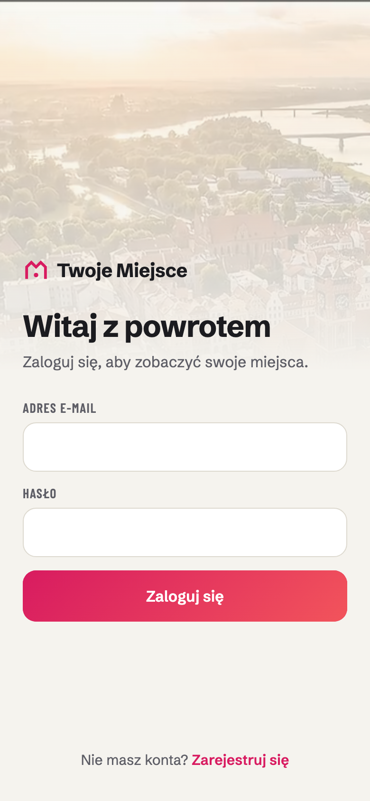
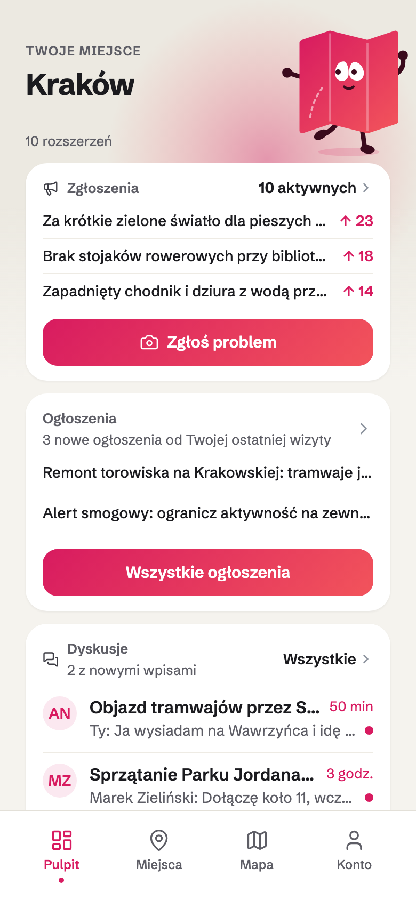
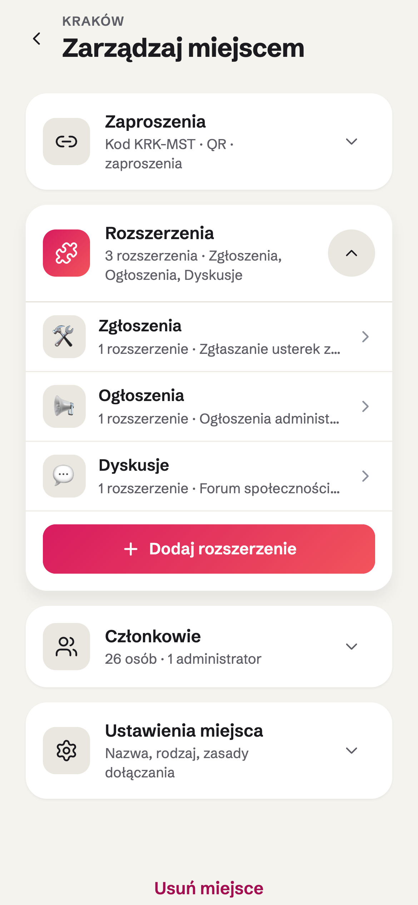
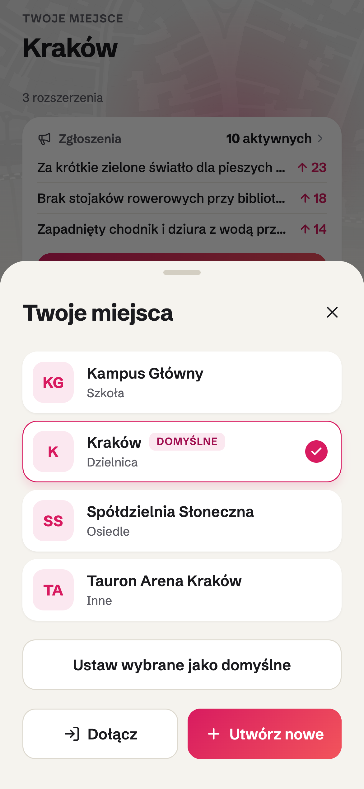
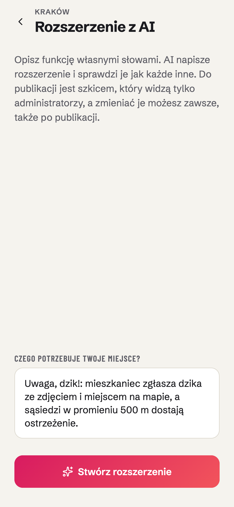
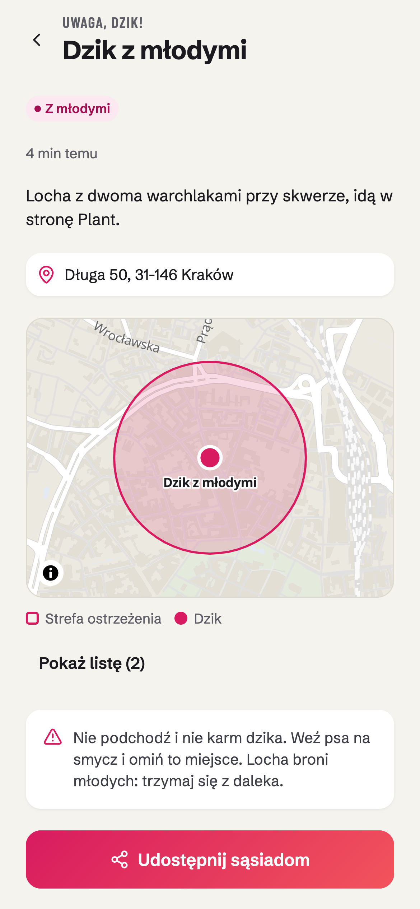
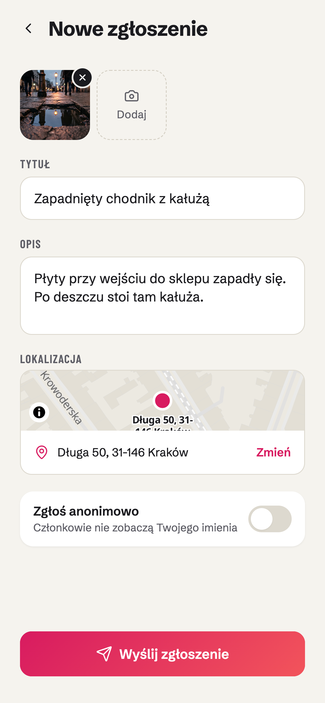
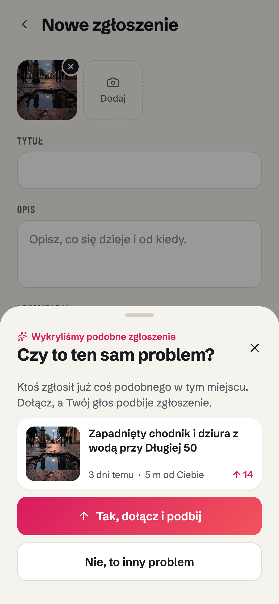

<!-- _class: title phones -->
<!-- _paginate: false -->
<!-- _footer: "" -->

Twój Team prezentuje

# Twoje Miejsce

## Rośnie razem z Twoimi potrzebami.

HackYeah 2026 · SMART CITY

 

<!--
Notatki: jedno zdanie o tym, czym jest Twoje Miejsce (cyfrowe społeczności dla prawdziwych miejsc: miasta, uczelni,
osiedla), i od razu przejście do problemu. Hasło pada tu. Na telefonach: ekran logowania i pulpit Krakowa
z konta anna@krakow.test.
-->

---

<!-- _class: statement -->

## Problem

# Potrzeby mieszkańców zmieniają się szybciej niż narzędzia miasta

- **Nowa usługa** to nowy projekt i kolejna aplikacja
- **Krótkie, lokalne potrzeby** zostają bez narzędzia
- **Mieszkańcy** radzą sobie sami na Facebooku

### Luka między potrzebą a narzędziem.

<!--
Notatki: to slajd o mechanizmie, nie o jednym przypadku. Rozwinięcie punktów na głos:
- Nowa usługa: analiza, zamówienie, wykonawca, kolejna aplikacja albo formularz. Zanim trafi do mieszkańców, potrzeba
  bywa już inna.
- Krótkie, lokalne potrzeby: jedno osiedle, jeden tydzień, jedna sytuacja. Nie opłaca się dla nich nic budować.
- Facebook: bez porządku, bez odpowiedzi urzędu i bez pewności, kto jest kim.
Ilustracja: powódź 2024. Do Trzebieszowic (154 zalane budynki) przyjechało 500 wolontariuszy, a sołtys mówił „ja jestem
sam i nie ogarniam wszystkiego”; w bocznych uliczkach Kłodzka „ludzie są pozostawieni sami sobie”, a pomoc organizowano
w grupach na Facebooku (Interia, „Pomocowy chaos. Tam ludzie są pozostawieni sami sobie”, wrzesień 2024). Liczby tylko
te ze źródeł (PRODUCT.md: żadnych wymyślonych danych).
-->

---

<!-- _class: statement phones -->

## Rozwiązanie

# Jedna aplikacja, która dopasowuje się do miejsca

- **Nowa funkcja** to rozszerzenie, nie aplikacja
- **Każde miejsce** włącza tylko to, czego potrzebuje
- **Jedno konto:** miasto, osiedle, uczelnia

### Brakuje funkcji? Wystarczy ją opisać.

 

<!--
Notatki: każdy punkt odpowiada na punkt z poprzedniego slajdu. Rozwinięcie na głos:
- Rozszerzenie: zgłoszenia, ogłoszenia i dyskusje na pulpicie Krakowa to trzy rozszerzenia. Nowa funkcja trafia do
  aplikacji, którą mieszkańcy już mają, bez aktualizacji w sklepie.
- Każde miejsce: administrator włącza rozszerzenia i układa pulpit mieszkańców (lewy telefon: „Zarządzaj miejscem”,
  rozszerzenia Krakowa i „Dodaj rozszerzenie”).
- Jedno konto: w demo anna@krakow.test należy do czterech miejsc (Kraków, Tauron Arena Kraków, Kampus Główny,
  Spółdzielnia Słoneczna) i przełącza się między nimi. iOS, Android i przeglądarka z jednej bazy kodu.
Ostatnie zdanie zapowiada slajd „Innowacja”.
-->

---

<!-- _class: phone tilt -->

## Innowacja

# Opisujesz funkcję, AI tworzy ją dla Ciebie

Jej kod przechodzi automatyczne sprawdzenie. Szkic widzą tylko administratorzy: przeglądasz go i publikujesz, a funkcja trafia do mieszkańców bez aktualizacji aplikacji.

<!--
Notatki: najważniejszy slajd (kryterium „pomysł”, 30%). Na zrzucie administrator Krakowa wpisuje prośbę: „Uwaga, dzik!:
mieszkaniec zgłasza dzika ze zdjęciem i miejscem na mapie, a sąsiedzi w promieniu 500 m dostają ostrzeżenie.”
Kroki: opis po polsku → AI pisze rozszerzenie → automatyczne sprawdzenie kodu → szkic widzą tylko administratorzy →
publikacja. Bez aktualizacji w sklepach i bez restartu serwera: nowy widżet pojawia się na otwartych telefonach w ciągu
kilkunastu sekund (pulpit odświeża się co 15 s). Zmiany też jednym zdaniem: „dodaj zdjęcie” tworzy nową wersję, a dane
rozszerzenia zostają.
Napisanie wersji przez AI trwa dłużej (limit 5 minut). Proponowany plan demo: wersja „Uwaga, dzik!” wygenerowana
wcześniej; na żywo wpisujemy prośbę, przechodzimy do gotowego szkicu, publikujemy, a drugi telefon (konto mieszkańca
z zapisanym miejscem w pobliżu) pokazuje ostrzeżenie.
-->

---

<!-- _class: statement phone -->

## Efekt

# Kilkanaście sekund później działa u mieszkańców

- **Nowy widżet** na pulpicie, bez aktualizacji aplikacji
- **Mieszkaniec zgłasza** dzika ze zdjęciem i miejscem
- **Sąsiedzi w promieniu 500 m** dostają ostrzeżenie

### Rozszerzenie nie zna niczyjej lokalizacji.

<!--
Notatki: to wynik prośby ze slajdu „Innowacja”. Na zrzucie: zgłoszenie dzika z mapą i strefą ostrzeżenia 500 m, tak jak
widzi je mieszkanka (anna@krakow.test). Uczciwie: rozszerzenie na zrzucie (plugins/boars) napisał zespół, jako przykład
tego, co powstaje z takiej prośby; działa na tym samym SDK i przeszło te same automatyczne sprawdzenia co kod od AI.
Rozwinięcie na głos:
- „Kilkanaście sekund”: otwarty pulpit odświeża się co 15 s, więc nowy widżet pojawia się bez aktualizacji w sklepie
  i bez restartu serwera.
- Ostrzeżenie dostają mieszkańcy z zapisanym miejscem w promieniu 500 m albo z pozycją udostępnioną w ciągu ostatnich
  30 minut. Dopasowuje ich serwer: rozszerzenie nie wie, kto mieszka gdzie, ani nawet ilu osobom poszło ostrzeżenie.
- To samo działa w skali miasta i w każdym innym miejscu: Kraków, osiedle, kampus.
-->

---

<!-- _class: statement phones -->

## Dla mieszkańca

# Usterkę zgłaszasz zdjęciem

- **Zdjęcie i pinezka** na mapie
- **AI pyta:** „Czy to ten sam problem?”
- **Powiadomienie,** gdy urząd odpowie

### Zgłoszenia to tylko jedno z rozszerzeń.

 

<!--
Notatki: to jest kryterium „użyteczność”. Cała ścieżka to kilka dotknięć, bez logowania do osobnego systemu miasta.
Rozwinięcie na głos:
- Zdjęcie (do 3), tytuł, opis i miejsce na mapie. Anonimowo, jeśli miejsce na to pozwala.
- Przed zapisem AI szuka tego samego problemu wśród aktywnych zgłoszeń. Jeśli go znajdzie, mieszkaniec dołącza:
  jego zdjęcia, głos i obserwowanie trafiają do wcześniejszego zgłoszenia, zamiast tworzyć nowe. Bez klucza AI (np. na
  lokalnym demo) dopasowanie działa po wspólnych słowach.
- Mieszkańcy podbijają i komentują zgłoszenia. Gdy urząd odpowie albo zamknie zgłoszenie, autor i osoby, które
  dołączyły, dostają powiadomienie (push na telefonie).
Ostatnie zdanie wraca do slajdu 3: to przykład rozszerzenia, nie cały produkt.
-->

---

<!-- _class: statement phone -->

> Zrzut: panel administratora zgłoszeń z kategorią i odpowiedzią urzędu

## Dla urzędu

# Jedno zgłoszenie zamiast wielu takich samych

- **Takie same zgłoszenia** łączą się w jedno
- **AI nadaje kategorię,** urząd może ją zmienić
- **Odpowiedź dociera** do każdego, kto zgłosił

### Urząd widzi, ilu mieszkańców dotyczy sprawa.

<!--
Notatki: to jest kryterium „związek z kategorią SMART CITY”. Mniej duplikatów to mniej pracy urzędu; mieszkaniec widzi
odpowiedź zamiast ciszy. Rozwinięcie na głos:
- Kategorie: drogi i chodniki, oświetlenie, czystość, zieleń.
- Urząd pisze odpowiedź dla mieszkańców i notatkę wewnętrzną. Zamknięcie zgłoszenia powiadamia autora i osoby, które
  dołączyły.
- W tym samym miejscu ogłoszenia i dyskusje.
- Ustawienia miejsca: głosowanie, komentarze, widoczność, zgłoszenia anonimowe, wymagane zdjęcie.
-->

---

<!-- _class: flow -->

## Przykład: Spółdzielnia Słoneczna

# Nowa potrzeba to nowa funkcja, nie nowa aplikacja

1. **Dziś** Usterki, ogłoszenia, dyskusje.
2. **Nowa potrzeba** Dziki na osiedlu. Dobre meble przy śmietniku.
3. **Administrator opisuje** „Uwaga, dzik!” i „Oddam za darmo”.
4. **Mieszkańcy dostają** ostrzeżenie o dziku w pobliżu i tablicę rzeczy do oddania.

- **Bez programisty i bez zamówienia.** AI pisze rozszerzenie, administrator je publikuje.

<!--
Notatki: to jest hasło „Rośnie razem z Twoimi potrzebami” w praktyce; jak to działa, pokazał slajd „Innowacja”.
Sprawne meble lądują przy śmietniku, choć sąsiad chętnie by je wziął. Administrator opisuje obie funkcje własnymi
słowami. Nic nowego do instalowania i uczenia się: to samo konto, te same powiadomienia, ten sam pulpit.
Ostrzeżenie dostają tylko mieszkańcy w promieniu np. 500 m (zapisane miejsce albo pozycja z otwartej aplikacji z ostatnich
30 minut), a rozszerzenie nie zna niczyjej lokalizacji: dopasowuje ją serwer. Następny slajd: to samo w skali miasta.
Bez liczb, których nie zmierzyliśmy.
-->

---

<!-- _class: flow -->

## Przykład: Kraków

# Komunikat trafia tylko do tych, których dotyczy

1. **Dziś** Zgłoszenia usterek, ogłoszenia urzędu, dyskusje.
2. **Nowa potrzeba** Remont, objazd, brak wody.
3. **Urząd opisuje** „Utrudnienia w okolicy”.
4. **Mieszkańcy dostają** mapę utrudnień i powiadomienie tylko o tych w swojej okolicy.

- **Rozszerzenie nie zna niczyjego adresu.** Okolicę dopasowuje serwer.

<!--
Notatki: ta sama droga co w spółdzielni, tylko skala inna. W spółdzielni ostrzeżenie dotyczy prawie wszystkich, w mieście
powiadomienie dla wszystkich byłoby spamem, więc dostaje je tylko okolica utrudnienia.
Urząd zaznacza na mapie obszar (np. ulicę w remoncie albo rejon bez wody), a powiadomienie dostają mieszkańcy z zapisanym
adresem albo niedawną pozycją w tym promieniu. Adresy mieszkańcy dodają sami w koncie („adresy do powiadomień w okolicy”).
SDK ma do tego gotowe elementy: obszary na mapie (`ui.map.areas`) i powiadomienia „w pobliżu” (promień do 50 km).
Tego rozszerzenia nie przygotowaliśmy na demo: to przykład opisu dla generatora, nie gotowa funkcja.
-->

---

<!-- _class: places -->

## Od miasta po dom

# Każde miejsce włącza swoje funkcje

- **Miasto**
  - Zgłoszenia usterek
  - Utrudnienia w okolicy
  - Budżet obywatelski
  - Konsultacje społeczne
- **Uczelnia**
  - Rezerwacja sal
  - Ogłoszenia dziekanatu
  - Zmiany w planie zajęć
  - Rzeczy znalezione
- **Spółdzielnia mieszkaniowa**
  - Uwaga, dzik!
  - Oddam za darmo
  - Odczyty liczników
  - Usterki w bloku
- **Dom**
  - Lista zakupów
  - Grafik sprzątania
  - Wspólne wydatki
  - Kalendarz rodziny

**Zgłoszenia, ogłoszenia i dyskusje działają w demo.** Resztę administrator opisuje, a AI pisze.

<!--
Notatki: ta sama aplikacja i ten sam generator od całego miasta po jedno mieszkanie; zmienia się tylko zestaw rozszerzeń.
Wbudowane rozszerzenia to zgłoszenia usterek, ogłoszenia i dyskusje. Pozostałe funkcje to przykłady opisów dla
generatora: nie przygotowaliśmy ich na demo (ROADMAP.md). Budżet obywatelski wymaga weryfikacji mieszkańców (mObywatel, v2).
-->
